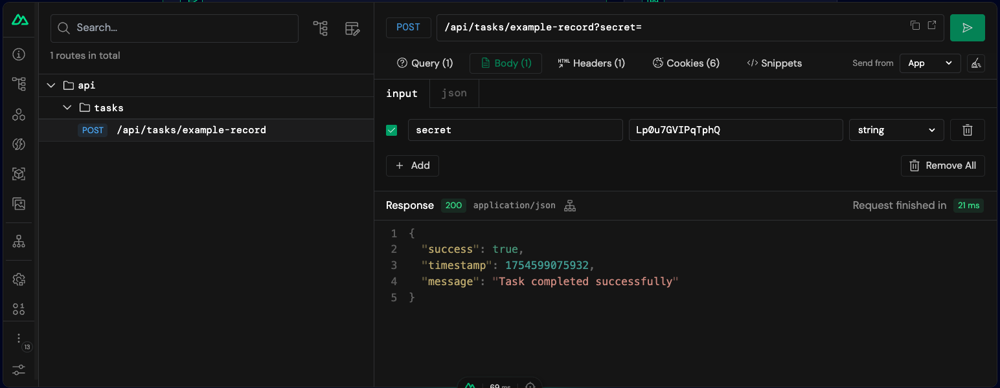

# How To Run Scheduled Tasks in Nuxt on Netlify - The Hacky Way … for now…

Nitro (and thus Nuxt) has experimental support for scheduled tasks. However, if you're deploying to Netlify, you'll quickly discover that Nitro's `scheduledTasks` feature doesn't work yet. Don't worry though - there's a workaround that's actually quite elegant!

## The Problem with Nitro's Scheduled Tasks

Nitro's experimental tasks feature allows you to define scheduled jobs directly in your Nuxt application:

```typescript
// nuxt.config.ts
export default defineNuxtConfig({
  nitro: {
    experimental: {
      tasks: true,
    },
    scheduledTasks: {
      "0 0 * * *": ["daily:cleanup"], // This won't work on Netlify
    },
  },
});
```

While this works great locally and on some platforms, Netlify doesn't support Nitro's scheduled tasks... yet.

## The Solution: Netlify Scheduled Functions + Nuxt API Endpoints

The workaround is surprisingly simple and follows good architectural principles:

1. **Create a Netlify Scheduled Function** that runs on your desired schedule
2. **Create a Nuxt API endpoint** that performs your scheduled task
3. **Use environment variables** to secure the endpoint
4. **Have the scheduled function ping the API endpoint**

This approach has several benefits:

- ✅ Works immediately on Netlify
- ✅ Keeps your task logic in your Nuxt app
- ✅ Easy to test and debug
- ✅ Secure with proper authentication
- ✅ Can be easily migrated to native Nitro tasks when Netlify supports them

## How to Implement Scheduled Tasks in Nuxt on Netlify

### Step 1: Create Your Task Logic as a Nuxt API Endpoint

First, let's create an API endpoint that will handle our scheduled task:

```typescript
// server/api/tasks/example-task.post.ts
export default defineEventHandler(async (event) => {
  const body = await readBody(event);

  // Validate the secret key
  const secretKey = useRuntimeConfig().taskSecret;
  if (!secretKey) {
    throw createError({
      statusCode: 500,
      statusMessage: "Secret must be set",
    });
  }

  if (body.secret !== secretKey) {
    throw createError({
      statusCode: 401,
      statusMessage: "Unauthorized",
    });
  }

  // Your actual task logic here
  const now = Date.now();
  console.log("Running example record task: ", now);

  // Example: Store something in KV storage
  const storage = useStorage("example:record");
  await storage.setItem(String(now), now);

  return {
    success: true,
    timestamp: now,
    message: "Task completed successfully",
  };
});
```

### Step 2: Create a Netlify Scheduled Function

Create a Netlify function that will call your API endpoint:

```typescript
// netlify/functions/example-task.mts
import type { Config } from "@netlify/functions";
import { $fetch } from "ofetch";

export default async (req: Request) => {
  const { next_run } = await req.json();

  console.log("Scheduled function triggered. Next run:", next_run);

  try {
    // Call your Nuxt API endpoint
    const response = await $fetch(`${process.env.URL}/api/tasks/example-task`, {
      method: "POST",
      body: {
        secret: process.env.NUXT_TASK_SECRET,
      },
    });
    if (!response.success) {
      throw new Error("Task failed", { cause: response });
    }
    console.log("Task completed:", response);
  } catch (error) {
    console.error("Task failed:", {
      cause: error,
    });
  }
};

// Run every hour
export const config: Config = {
  schedule: "@hourly",
};
```

### Step 3: Configure the Environment Variable

Add the required environment variables to your Netlify site:

1. `NUXT_TASK_SECRET` - A secure random string to authenticate task requests
2. `URL` - Your site URL (Netlify automatically provides this)

You can set these in your Netlify dashboard under Site Settings > Environment Variables, or use the Netlify CLI:

```bash
# Generate a secure random string and set it as an environment variable in Netlify
netlify env:set NUXT_TASK_SECRET $(openssl rand -base64 25)
```

### Step 4: Add Runtime Config

Update your Nuxt config to include the runtime config:

```typescript
// nuxt.config.ts
export default defineNuxtConfig({
  compatibilityDate: "2025-07-15",
  devtools: { enabled: true },

  runtimeConfig: {
    taskSecret: null, // this will be set to the environment variable NUXT_TASK_SECRET under the hood
  },
});
```

### Step 5: Configure netlify.toml (Optional)

You can also configure your scheduled function in `netlify.toml`
(instead of in the scheduled function):

```toml
# netlify.toml
[functions."example-task"]
schedule = "@hourly"

```

## Testing Your Setup

### Local Testing

1. **Test the API endpoint directly:**

Use curl to test the API endpoint directly:

```bash
curl -X POST http://localhost:3000/api/tasks/example-task \
  -H "Content-Type: application/json" \
  -d '{"secret":"your-secret-key"}'
```

or use the Nuxt Devtools:



2. **Test the Netlify function locally:**

```bash
npx netlify dev
npx netlify functions:invoke example-task
```

### Production Testing

Once deployed, you can trigger your scheduled function manually from the Netlify dashboard or use the CLI:

```bash
netlify functions:invoke example-task --name your-site-name
```

## Cron Expression Examples

Here are some common cron expressions you can use:

```typescript
// Every minute (for testing)
schedule: "* * * * *";

// Every hour
schedule: "@hourly";

// Every day at midnight UTC
schedule: "@daily";

// Every Monday at 9 AM UTC
schedule: "0 9 * * 1";

// Every first day of the month at 2 AM UTC
schedule: "0 2 1 * *";
```

Use [crontab.guru](https://crontab.guru/) to easily generate and test cron expressions.

## Security Considerations

1. **Always validate the secret key** in your API endpoints
2. **Use HTTPS** for all requests (Netlify provides this automatically)
3. **Don't log sensitive information** like secret keys
4. **Use strong, random secret keys** and rotate them regularly

## Limitations

- The task is limited to the timeout of the Netlify function (10 seconds by default - but you can [request an increase in the Netlify support forum](https://answers.netlify.com/t/function-timeout-increase/53881))

## Monitoring and Debugging

### Netlify Function Logs

You can view logs for your scheduled functions in the Netlify dashboard under Functions > [Your Function] > Function log.

### Nuxt Server Logs

Your Nuxt API endpoint logs will appear in your site's function logs (function name is usually `server`) since Nuxt runs as a Netlify function.

## Migration Path

When Netlify eventually supports Nitro's scheduled tasks, migration will be straightforward:

1. Remove the Netlify scheduled function
2. Move your task logic from the API endpoint to a proper Nitro task
3. Remove the authentication code (no longer needed)
4. Update your `nuxt.config.ts` to use only Nitro's `scheduledTasks`

## Conclusion

While we wait for native Nitro scheduled task support on Netlify, this workaround provides a robust solution that's actually quite elegant. It follows good separation of concerns, is easy to test, and provides a clear migration path for the future.

The combination of Netlify's scheduled functions with Nuxt API endpoints gives you all the power you need for automated tasks, with the added benefit of being able to manually trigger tasks through your API if needed.

## Resources

- [Nitro Tasks Documentation](https://nitro.build/guide/tasks)
- [Netlify Scheduled Functions](https://docs.netlify.com/build/functions/scheduled-functions/)
- [Cron Expression Generator](https://crontab.guru/)
- [Nuxt Runtime Config](https://nuxt.com/docs/guide/going-further/runtime-config)

---

_This workaround was tested with Nuxt 4.0.1 and Netlify Functions. As both platforms evolve, some details may change. Always refer to the official documentation for the latest information._
